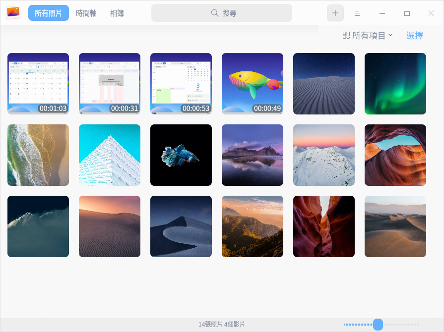
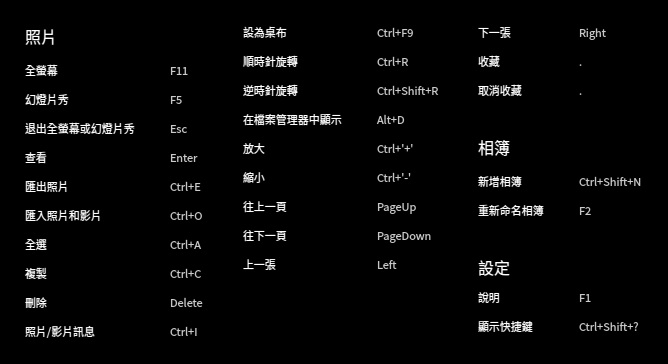
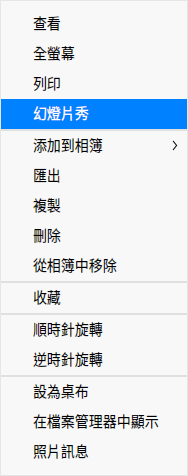
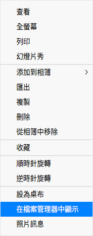
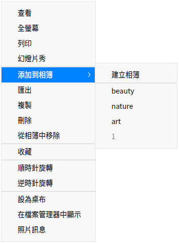

# 相簿|deepin-album|

## 概述

相簿是一款外觀時尚、性能流暢的相片管理工具，支援查看、管理多種圖片格式。您可以按日期時間軸排列相片，還可以將相片添加到個人收藏，或者歸類到不同的相簿中，將相片管理得井井有條。

## 使用入門

透過以下方式執行或關閉相簿，或者建立相簿的捷徑。

### 執行相簿

1. 單擊任務欄上的啟動器圖示 ，進入啟動器介面。
2. 上下滾動滑鼠滾輪瀏覽或透過搜尋，找到相簿  單擊執行。
3. 右鍵單擊 ，您可以：
 - 單擊 **建立桌面捷徑**，在桌面建立捷徑。
 - 單擊 **釘選到Dock**，將應用程式固定到Dock。
 - 單擊 **開機啟動**，將應用程式添加到開機啟動項，在電腦開機時自動執行該應用。

   > 竅門：您可以在控制中心將相簿設定為預設的相片查看程式，具體操作請參考 [預設程式設定](dman:///dde#預設程式設定)。

### 關閉相簿

- 在相簿介面單擊  ，關閉相簿。
- 在任務欄右鍵單擊 ，選擇 **全部關閉** ，關閉相簿。
- 在相簿介面單擊  ，選擇 **離開** ，關閉相簿。

### 查看快捷鍵

在相簿介面上，使用快捷鍵 **Ctrl + Shift + ?** 打開快捷鍵預覽介面。熟練的使用快捷鍵，將大大提升您的操作效率。

## 相片管理

相簿啟動後，您可以透過時間軸和相簿管理您的相片。

### 匯入相片

在相簿介面，可以採用以下方式匯入相片。
- 當相冊中尚無照片時，單擊 **匯入相片**。

- 單擊> **匯入相片**。

- 直接將相片或所在資料夾拖曳到介面上。

- 從移動裝置匯入相片。

   > 說明：相簿支援打開BMP、GIF、JPG、PNG、PBM、PGM、PPM、XBM、XPM、SVG、DDS、ICNS、MNG、TGA、TIFF、WBMP、WEBP、PSD、ICO、JNG、PCD、PCX、TIF、RAS、MRW、DNG、RAF、CR2、RAW、ORF、NEF等多種格式的圖片。

### 搜尋相片

1. 在相簿頂部的搜尋框，單擊 ，輸入關鍵字。
2. 按下鍵盤上的 **Enter** 鍵後顯示搜尋結果。

### 查看相片

在相簿介面上，單擊底部的滾動條可以調整相片的縮圖大小。

雙擊相片，或右鍵單擊相片選擇 **查看相片** ，進入查看圖片介面；按 **Esc** 鍵退出查看圖片介面。

| 圖示                                                    | 名稱       | 說明                         |
| ------------------------------------------------------- | ---------- | ---------------------------- |
|               | 返回       | 顯示返回到主介面。           |
|                      | 上一張     | 顯示上一張相片。             |
|                              | 下一張     | 顯示下一張相片。             |
|                | 1:1檢視    | 相片按照實際尺寸顯示。       |
|              | 適應視窗   | 相片適應視窗尺寸顯示。       |
|                        | 收藏       | 將喜歡的相片添加到我的最愛。 |
|  | 順時針旋轉 | 相片順時針旋轉90度。         |
|              | 逆時針旋轉 | 相片逆時針旋轉90度。         |
|                          | 刪除       | 刪除目前照片。               |

   > 竅門：滾動滑鼠放大圖片且當圖片超出介面範圍時，介面上會出現導航視窗。拖動導航視窗內的方框，查看該區域的訊息。單擊導航視窗右上角 **x** 按鈕，關閉導航視窗；也可以在看圖介面上單擊滑鼠右鍵選擇 **隱藏導航視窗**/ **顯示導航視窗**。

### 查看時間軸

在時間軸中，所有相片按照日期劃分，同一天的相片顯示在一起，不同日期的相片分欄排列。查看時間軸可以快速找到某一天的相片。

### 列印相片

1. 在相簿介面上，單擊滑鼠右鍵，選擇 **列印**。
2. 選擇一個印表機，根據需要設定列印屬性。
3. 選擇 **列印**，將照片發送到印表機進行列印。

### 幻燈片秀

1. 在相簿介面上，右鍵單擊相片。
2. 選擇 **幻燈片秀**，相片將以幻燈片形式全螢幕播放。
3. 按下鍵盤上的 **Esc** 鍵退出播放。

### 複製相片

1. 在相簿介面上，右鍵單擊相片。
2. 選擇 **複製**。
3. 在桌面或者指定位置，單擊滑鼠右鍵。
4. 選擇 **貼上**，將照片文件複製到該位置。

### 收藏相片

1. 在相簿介面上，右鍵單擊相片。
2. 選擇 **收藏**，照片將會添加到「我的最愛」。
3. 右鍵單擊已收藏的相片，也可以 **取消收藏**。

   > 竅門：在查看照片時，單擊介面上的 ，將相片加入我的最愛。再次單擊 ，取消收藏。

### 旋轉相片

1. 在相簿介面上，右鍵單擊相片。
2. 選擇 **順時針旋轉 / 逆時針旋轉**。
3. 相片將會順時針轉旋轉90°/逆時針旋轉90°。

> 說明：當使用觸摸屏電腦時，二指放置在照片上並保持一定距離，同時旋轉二指旋轉照片。

### 設定為桌布

1. 在相簿介面上，右鍵單擊相片。
2. 選擇 **設為桌布** 即可將目前相片設定為桌布。

### 在檔案管理器中顯示

1. 在相簿介面上，右鍵單擊相片。
2. 選擇 **在檔案管理器中顯示**，定位該相片的存儲位置。

### 查看相片訊息

1. 在相簿介面上，右鍵單擊相片。
2. 選擇 **相片訊息** 查看相片的詳細訊息。

### 刪除相片

在相簿中您可以透過如下方法刪除相片：

- 查看圖片時，單擊介面上的 圖示。
- 右鍵單擊照片，選擇 **刪除**。
- 在相簿介面上，按下鍵盤上的 **Delete** 鍵。

   > 竅門：在相簿中刪除的相片並沒有被永久刪除，而是暫時存放在「垃圾桶」中。當相片上的剩餘天數顯示為0天時，相片將被永久刪除。您可以提前復原或徹底刪除這裡的相片。

## 相簿管理

在相簿介面，您可以建立相簿，管理相簿中的相片，查看所有相簿。

   > 說明：**匯入**、**垃圾桶**、**我的最愛** 是系統根據實際情況自動生成的，這3個相簿不可刪除、重新命名。

### 新增相簿

1. 在相簿介面，單擊  或  > **新增相簿**。
2. 輸入相簿名稱，單擊 **建立**。

   > 竅門：右鍵單擊已建立的相簿，也可以建立相簿。您還可以在添加相片到相簿時建立相簿。

### 添加照片到相簿

1. 在相簿介面上，右鍵單擊相片。
2. 選擇 **添加到相簿**。
3. 選擇一個相簿，將相片添加到相簿中。

   > 竅門：也可以直接拖曳相片或相片資料夾到相簿中，添加相片到相簿。

### 移除相簿中的相片

1. 在相簿介面上，右鍵單擊相簿中的相片。
2. 選擇 **從相簿中移除**，將相片從該相簿中移除。

### 重新命名相簿

1. 在相簿介面上，右鍵單擊需要改名的相簿。
2. 選擇 **重新命名**。
3. 輸入相簿名稱，按下 **Enter** 鍵，或者單擊介面的空白區域儲存修改。

### 匯出相簿

1. 在相簿介面上，右鍵單擊一個相簿。
2. 選擇 **匯出**。

### 刪除相簿

1. 在相簿介面上，右鍵單擊一個相簿。
2. 選擇 **刪除**。

## 主選單

在主選單中，您可以[新增相簿](#新增相簿)、[匯入相片](#匯入相片)、切換視窗主題、查看說明手冊，了解相簿的更多資訊。

### 主題

視窗主題包含亮色主題、暗色主題和系統主題。

1. 在相簿介面，單擊 。
2. 單擊 **主題**，選擇一個主題顏色。

### 說明

查看說明手冊，進一步了解和使用相簿。

1. 在相簿介面，單擊 。
2. 單擊 **說明**。
3. 查看相簿的說明手冊。

### 關於

1. 在相簿介面，單擊 。
2. 單擊 **關於**。
3. 查看相簿的版本和介紹。

### 離開

1. 在相簿介面，單擊 。
2. 單擊 **離開**。
